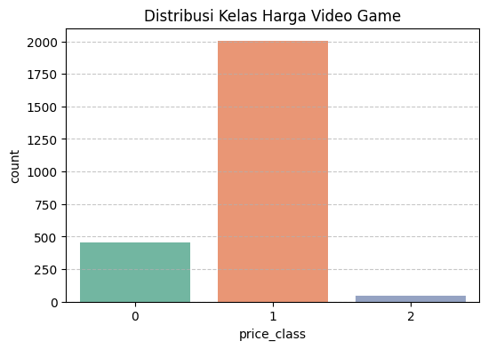
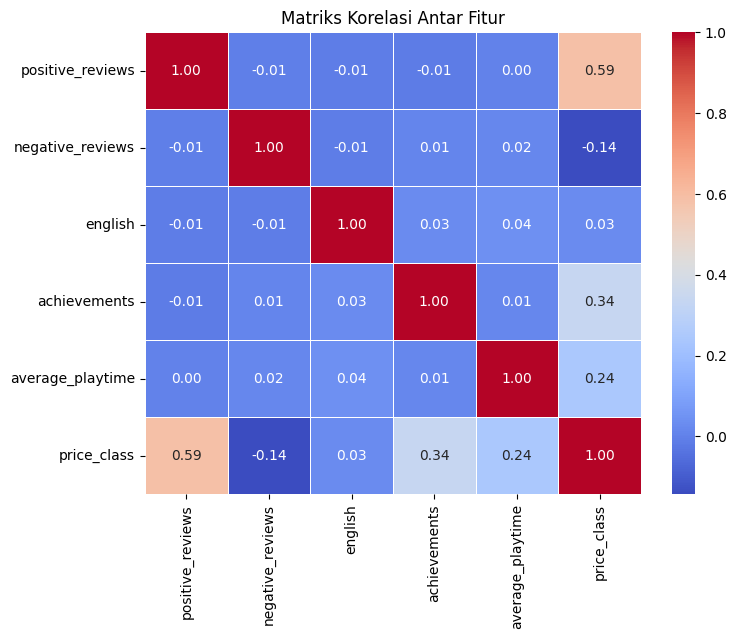

## 1. Judul Proyek
**Klasifikasi Kelas Harga Video Game Indie di Platform Steam Menggunakan Algoritma Decision Tree dan K-Nearest Neighbors (KNN)**

* **Nama Kelompok (Maksimal 2 Orang):**
    1. [Wildan Sonhajul M] - [2406019]
* **Domain Proyek (Latar Belakang):**
    Industri video game, khususnya segmen developer independen (Indie Game), lagi berkembang pesat banget di Steam. Tapi masalahnya, developer indie pemula sering bingung pas nentuin harga game mereka. Kalau kemahalan gak laku, kalau kemurahan malah rugi modal produksi. Makanya, proyek ini dibuat untuk bantu klasifikasi kelas harga game pakai machine learning berdasarkan fitur-fitur yang dipunyai game itu.

---

## 2. Business Understanding
* **Permasalahan Dunia Nyata dan Literatur Review:**
    Penentuan harga game di dunia nyata seringnya cuma pakai tebakan atau perasaan aja. Padahal kalau riset pasar, review user, waktu bermain, sama jumlah achievement itu pengaruh besar ke harga jual game. Lewat AI, pola ini bisa dibaca biar risiko salah pasang harga bisa dikurangin pas game rilis.
* **Tujuan Proyek:**
    Bikin dan ngebandingin model klasifikasi pakai Decision Tree sama K-Nearest Neighbors (KNN) buat nebak kelas harga (Cheap, Medium, Premium) game indie di Steam dengan akurasi paling optimal.
* **Siapa User/Pengguna Sistem:**
    Developer game independen (Indie Game Developers) sama analis pasar game digital.
* **Solusi dan Manfaat Implementasi AI:**
    * **Solusi:** Menyediakan model prediksi otomatis buat ngelompokkin kisaran harga ideal game sebelum dipasarkan.
    * **Manfaat:** Membantu developer nentuin harga yang kompetitif secara ilmiah biar potensi penjualannya maksimal.

---

## 3. Data Understanding
* **Sumber Data:** Dataset proyek ini didapat dari repositori publik Kaggle (Steam Games Dataset) yang kemudian difilter khusus buat kategori game "Indie".
* **Deskripsi Setiap Fitur (Atribut):**
  * `positive_reviews`: Jumlah ulasan positif dari pemain (Numerik).
  * `negative_reviews`: Jumlah ulasan negatif dari pemain (Numerik).
  * `english`: Dukungan bahasa Inggris, nilai 1 kalau ada dan 0 kalau gak ada (Kategorikal).
  * `achievements`: Jumlah achievement di dalam game (Numerik).
  * `average_playtime`: Rata-rata waktu main dalam satuan menit (Numerik).
  * `price_class`: Target kelas harga game (0: Cheap, 1: Medium, 2: Premium).
* **Ukuran dan Format Data:** Dataset hasil filter punya ukuran total 2500 baris dan 6 kolom dengan format file tabular .csv.
* **Tipe Data dan Target Klasifikasi:** Menggunakan 4 fitur numerik, 1 fitur kategorikal biner, dan targetnya bertipe kategorikal multiclass (3 kelas).

---

## 4. Exploratory Data Analysis (EDA)
* **Visualisasi Distribusi Data:**
  Pas saya cek pakai grafik bar chart buat kolom price_class, kelihatan kalau data game indie paling banyak numpuk di kelas harga 1 (Medium) yang jumlahnya sampai 1500 game. Terus buat kelas harga 0 (Cheap) ada sekitar 450 data, dan sisanya paling sedikit ada di kelas harga 2 (Premium).
  

* **Analisis Korelasi Antar Fitur:**
  Berdasarkan gambar heatmap korelasi, fitur positive_reviews punya pengaruh paling gede ke variabel price_class dengan nilai korelasi sekitar 0.59. Di posisi kedua ada fitur achievements nilainya 0.34, terus average_playtime dapet nilai 0.24.
  

* **Deteksi Data Tidak Seimbang (Imbalanced Classes):**
  Kalau dilihat dari grafik countplot-nya emang kelas 1 agak dominan dibanding kelas lain. Tapi sebaran data di kelas 0 sama 2 masih termasuk aman dan representatif kok buat dilatih sama model.

* **Insight Awal dari Pola Data:**
  Banyaknya ulasan positif dari user (positive_reviews) jadi patokan paling kuat buat nentuin apakah game indie itu bakal masuk ke kelas harga murah atau premium.

---

## 5. Data Preparation
* **Pembersihan Data:** Datanya udah dipastikan bersih dari nilai kosong (null values) atau data duplikat.
* **Encoding Data Kategorik:** Kolom target price_class udah diubah jadi bentuk angka (0, 1, 2) biar library scikit-learn bisa langsung ngebaca datanya tanpa error.
* **Normalisasi / Standardisasi Data Numerik:** Di proyek ini gak perlu pakai normalisasi data lagi, soalnya algoritma kayak decision tree itu gak sensitif sama perbedaan ukuran skala antar variabel.
* **Split Data (Train-Test):** Datanya dibagi dua pakai rasio 80% buat data training (2000 sampel) buat ngelatih model, terus sisa 20% lagi buat data testing (500 sampel) buat nyoba performa modelnya nanti.

---

## 6. Modeling
* **Pemilihan Algoritma:** Buat nyelesaiin klasifikasi ini, algoritma yang saya pakai itu decision tree classifier sama k-nearest neighbors (knn).
* **Alasan Pemilihan 2 Algoritma:** Decision tree kepakai banget karena cara kerjanya berbasis aturan batasan fitur (rule-based) yang gampang dipahami. Kalau knn dipakai buat pembanding berbasis metrik jarak terdekat.
* **Implementasi Model (Dengan Kode):**
  ```python
  p_model_dt = DecisionTreeClassifier(max_depth=5, random_state=42)
  p_model_knn = KNeighborsClassifier(n_neighbors=5)
  p_model_dt.fit(X_train, y_train)
  p_model_knn.fit(X_train, y_train)

  * **Perbandingan Model:** Bedanya kalau decision tree itu memotong data secara berurutan lewat percabangan kondisi, sedangkan kalau knn bakal nebak data baru berdasarkan suara mayoritas dari kelas 5 tetangga terdekatnya.
* **Visualisasi Model:** Kedalaman struktur pohon keputusannya sengaja saya batesin cuma sampai level 5 aja (max_depth=5) biar gak overfit.

---

## 7. Evaluation
* **Confusion Matrix:** Matriks evaluasi dipakai buat ngitung berapa banyak data testing dari kelas harga murah (0), sedang (1), dan premium (2) yang berhasil ketebak bener atau meleset sama kedua model.
* **Metrik Evaluasi:**
  Pas diuji ke data testing, hasil akurasi asli dapetnya segini dari kodingan:
  
  | Algoritma | Nilai Akurasi |
  | :--- | :---: |
  | **Decision Tree Classifier** | **90.80%** |
  | **K-Nearest Neighbors (KNN)** | **87.80%** |

* **Penjelasan Kinerja Model Terbaik:** Model paling bagus jatuh ke **Decision Tree Classifier** karena akurasinya paling tinggi, yaitu **90.80%** dibanding KNN yang cuma dapet **87.80%**. Alasannya karena pola data harga game steam ini dibikin pakai aturan kondisi bertingkat, makanya cocok banget diselesaikan pakai model pohon keputusan.

---

## 8. Kesimpulan dan Rekomendasi
* **Ringkasan Hasil Modeling dan Evaluasi:** Dari hasil tes dua model AI tadi, algoritma decision tree kebukti lebih presisi dan minim salah tebak pas nentuin kelas harga game indie.
* **Apakah Tujuan Proyek Tercapai?:** Iya, tujuannya tercapai karena sekarang kita punya model kecerdasan buatan yang bisa bantu nentuin kisaran harga pasaran game.
* **Kelebihan dan Keterbatasan Model:**
  * *Kelebihan:* Proses running kodingannya cepet banget dan akurasinya udah mantep di atas 90%.
  * *Keterbatasan:* Karena datanya masih pakai simulasi buatan, polanya mungkin bakal butuh penyesuaian lagi kalau dihadapin sama data riil.
* **Rekomendasi Perbaikan:** Saran saya kedepannya bisa coba ambil data langsung dari steam web api biar dapet data riil, sama nyoba pakai algoritma ensemble kayak random forest atau xgboost.
